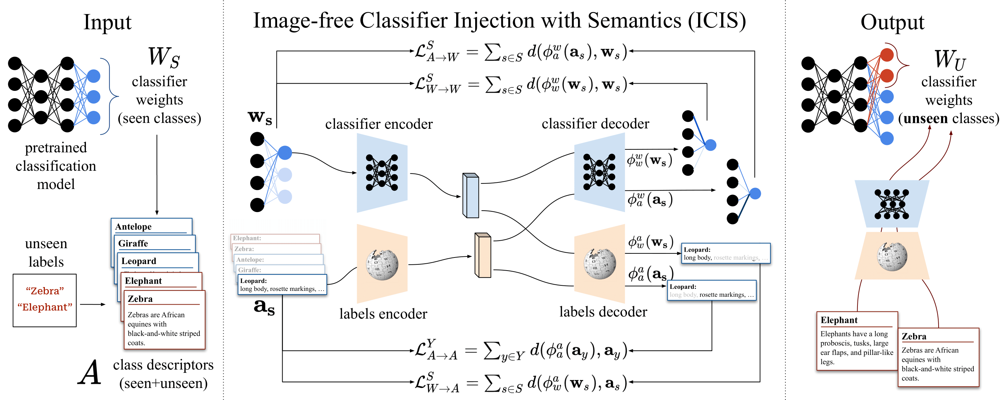

# Image-free Zero-Shot Learning
This is the official repository for [Image-free Classifier Injection for Zero-Shot Classification](https://arxiv.org/abs/2308.10599), published at ICCV 2023.  

<p align="center">
  
</p>
  

## Prerequisites

1. Extracted fine-tuned CUB, AWA2, and SUN features are available [here](https://github.com/uqzhichen/SDGZSL) (clicking on "datasets" under the "Usage" section will lead you to [this zip file on Google Drive](https://drive.google.com/file/d/1KxFC6T_kGKCNx1JyX2FOaSimA0DOcU_I/view)) Features are originally from [this paper](https://github.com/akshitac8/tfvaegan). 

2. Pre-trained ResNet101 features for CUB, AWA2, and SUN datasets are available [here](https://drive.google.com/drive/folders/18egafUzqWp7kavtBSk78O0R2L1mx0dLX?usp=sharing). We extract the features using the current version (2) of ResNet101 available via `torchvision`. See `/utility/feature_extraction/feature_extract.py`. We use the [proposed datasplits](https://www.mpi-inf.mpg.de/departments/computer-vision-and-machine-learning/research/zero-shot-learning/zero-shot-learning-the-good-the-bad-and-the-ugly) ("Proposed Split Version 2.0"). Image datasets are avaiable here for [CUB](https://www.vision.caltech.edu/datasets/cub_200_2011/), [AWA2](https://cvml.ista.ac.at/AwA2/), and [SUN](https://groups.csail.mit.edu/vision/SUN/hierarchy.html).

3. Modify default "dataroot" and "rootpath" in main.py (to point to your data path and where to save outputs, respectively).


## Usage

Scripts are supplied (in the scripts folder) for experiments behind the various tables. By default, these scripts will run a single random seed and include training/loading the base classiciation model and evaluation of the specified I-(G)ZSL method. Seed number can be increased either with the --numSeeds arg, or by supplying fixed seeds with the --manualSeed arg (the latter will also speed up experiments, as base classification models can be reused).

A .yml file is supplied with the environment. (Replace version of `cudatoolkit` with the appropriate CUDA version of your system. Our experiments were done using CUDA/11.1 and CUDNN/8.1). 

Classnames for ImageNet1K are available in `/utility/`.

Example usage apart from scripts include:

```bash
$ python main.py --cuda --manualSeed 0 --dataset=CUB --image_embedding=res101_finetuned --class_embedding=att --cos_sim_loss --include_unseen --num_layers 2 --beta1 0.9 --lr 0.00001 --batch_size 16 --embed_dim 2048 --strict_eval --early_stopping_slope
```

## Citation 

If you use this code, please cite
```
@InProceedings{Christensen_2023_ICCV,
    author    = {Christensen, Anders and Mancini, Massimiliano and Koepke, A. Sophia and Winther, Ole and Akata, Zeynep},
    title     = {Image-Free Classifier Injection for Zero-Shot Classification},
    booktitle = {Proceedings of the IEEE/CVF International Conference on Computer Vision (ICCV)},
    month     = {October},
    year      = {2023},
    pages     = {19072-19081}
}
```

**Note**: The wDAE-GNN, Sub.Reg. and wAVG/SMO implementations are imported from their respective repositories and adapted to our usecase. If you find those parts useful, please consider citing them.

## Contact 

Code will receive minor updates. Questions etc. can be sent by email to

Anders Christensen

andchri@dtu.dk

Technical University of Denmark & University of Tübingen

<p align="center">
  
</p>
