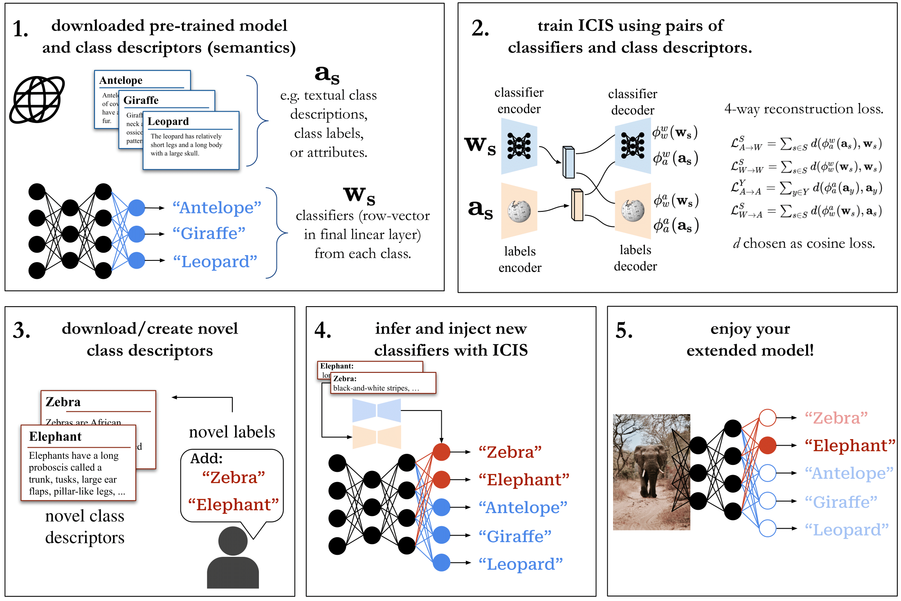

# Image-free Zero-Shot Learning
This is the official repository for [Image-free Classifier Injection for Zero-Shot Classification](https://arxiv.org/abs/2308.10599), published at ICCV 2023.  

**Note:** Code is being cleaned and will be available soon (delayed due to ICLR). Until then, please reach out to andchri@dtu.dk in case of questions.

  

  
## Contact 

Questions etc. can be sent by email to

Anders Christensen

andchri@dtu.dk

Technical University of Denmark & University of Tübingen

  

